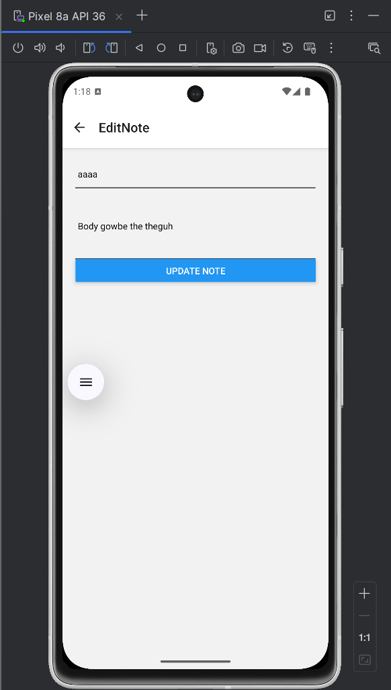
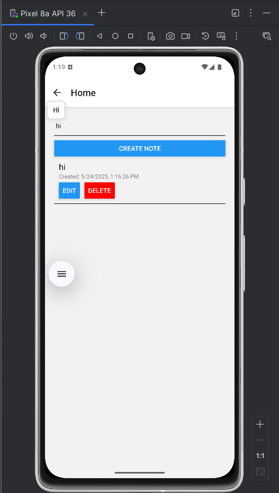

 📝 Notes App (React Native)

A simple React Native Notes App that allows users to create, view, edit, and delete notes — all stored in-memory using React state. Built using React Navigation and functional components.

---

## ✅ Features Implemented

- ✅ Create a note (title + body)
- ✅ List all notes on the home screen
- ✅ View individual note details
- ✅ Delete a note from the list
- ✅ Edit existing notes
- ✅ Show timestamp for each note (created or last updated)

---

## ▶️ How to Run the Project

### Prerequisites

- Node.js and npm
- Expo CLI (install via `npm install -g expo-cli`)
- Git (optional)

### Steps

1. **Clone the Repository** (or download the code folder):

```bash
git clone https://github.com/yourusername/notes-app-react-native.git
cd notes-app-react-native
````

2. **Install Dependencies**:

```bash
npm install
```

3. **Start the Project**:

```bash
npx expo start
```

4. **Run on Device or Emulator**:

* Scan the QR code using the Expo Go app (Android/iOS).
* Or, use an emulator via Expo DevTools.

---

## 📸 Screenshots

### 🏠 Home Screen


### 📝 Create Note Screen


### ✏️ Update Note Button


### 🛠️ Update/Edit Note Screen


### 🔍 Search Notes



---

## 🛠 Tech Stack

* React Native (JavaScript)
* React Navigation
* Expo CLI

---

## 📂 Project Structure

```
App.js
/screens
  HomeScreen.js
  CreateNoteScreen.js
  NoteDetailScreen.js
  EditNoteScreen.js
```

---

## ⚠️ Notes

* Data is stored temporarily in memory (non-persistent).
* Closing the app will reset the notes (for permanent storage, you can add `AsyncStorage`(code present in comments) later).

---

## 🙌 Author

Made with 💙 by korra chintu

```

---
